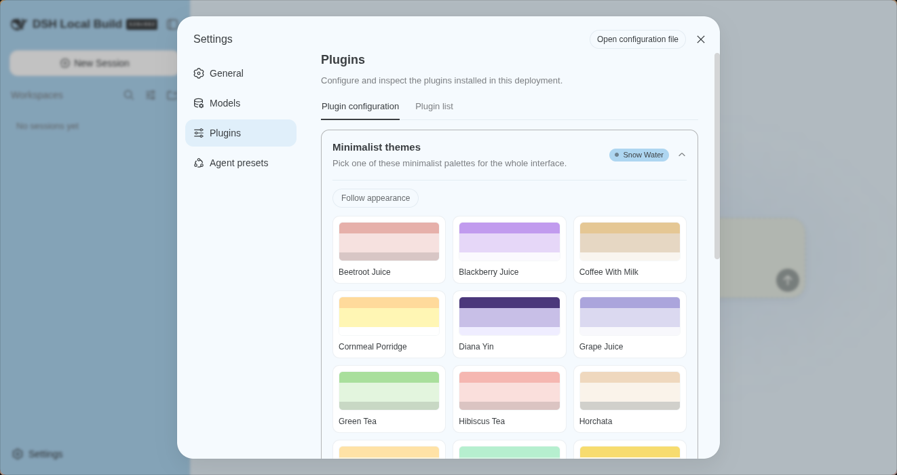

# DSH Minimalist Themes

English | [中文](README.zh.md)

The idea was simple: build a collection of minimalist color palettes based on an earlier project. The goal was to give DeepSeek Harness (DSH) a more colorful, softer tone — one that would fit its minimalist design perfectly.

Since the philosophy behind DSH is that everything is a plugin, I tried to adapt this creation as best I could. So you'll find it under **Settings → Plugins → Minimalist themes**. Once there, you'll see 18 minimalist themes at your disposal, and you can switch between them with a single click.



[](LICENSE) [](https://github.com/mykeura/dsh-minimalist-themes) [](https://www.typescriptlang.org) [](https://react.dev)

---

## Install

```sh
pnpm dsh plugin --profile web add github:mykeura/dsh-minimalist-themes
# pin a version:
pnpm dsh plugin --profile web add github:mykeura/dsh-minimalist-themes#v1.0.0
```

Once the plugin is installed, you can access its configuration from **Settings → Plugins**.

## Themes

| Beetroot Juice | Blackberry Juice | Coffee With Milk |
| --- | --- | --- |
| Cornmeal Porridge | Diana Yin | Grape Juice |
| Green Tea | Hibiscus Tea | Horchata |
| Mango | Mint | Nance Juice |
| Oceans | Orange Juice | Snow Water |
| Turquoise | Ultramarine | Yuzu |

## License

MIT — see [LICENSE](LICENSE).
