# DSH Minimalist Themes

[English](README.md) | 中文

想法很简单：基于之前的一个项目，做一套极简风格的配色。目的是让 DeepSeek Harness（DSH）的颜色更丰富、更柔和，跟它那极简的设计完美贴合。

既然 DSH 的理念是「一切皆插件」，我就尽力把这份创作适配好。你可以在 **设置 → 插件 → Minimalist themes** 找到它。进去之后有 18 套极简主题，点一下就能切来切去。


[](LICENSE) [](https://github.com/mykeura/dsh-minimalist-themes) [](https://www.typescriptlang.org) [](https://react.dev) [](https://developer.mozilla.org/en-US/docs/Web/JavaScript) [](https://developer.mozilla.org/en-US/docs/Web/CSS)

---

## 安装

```sh
pnpm dsh plugin --profile web add github:mykeura/dsh-minimalist-themes
# 固定版本：
pnpm dsh plugin --profile web add github:mykeura/dsh-minimalist-themes#v1.0.0
```

安装好插件后，可以从 **设置 → 插件** 进入它的配置。

## 主题

|   |   |
| --- | --- |
| 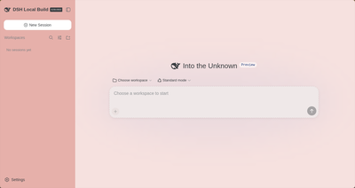<br>Beetroot Juice | 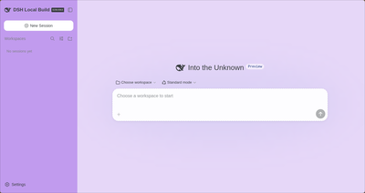<br>Blackberry Juice |
| 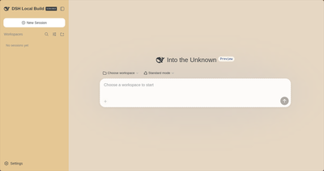<br>Coffee With Milk | 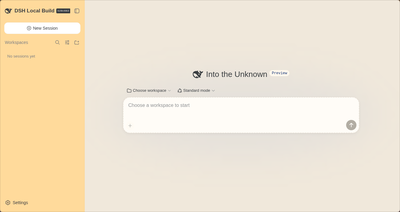<br>Cornmeal Porridge |
| 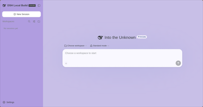<br>Diana Yin | 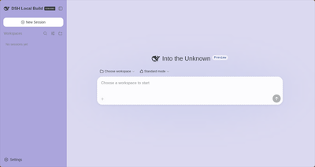<br>Grape Juice |
| 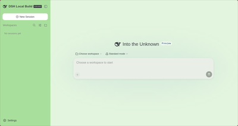<br>Green Tea | 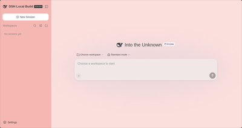<br>Hibiscus Tea |
| 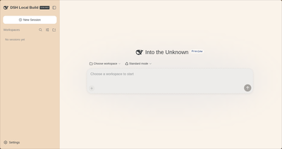<br>Horchata | 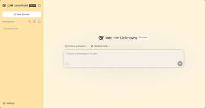<br>Mango |
| 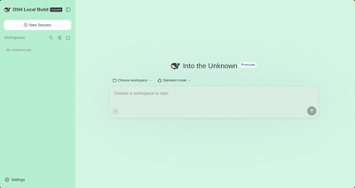<br>Mint | 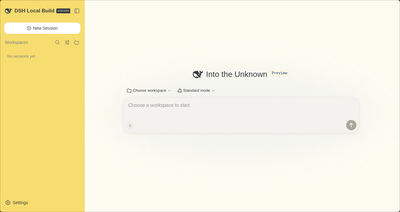<br>Nance Juice |
| 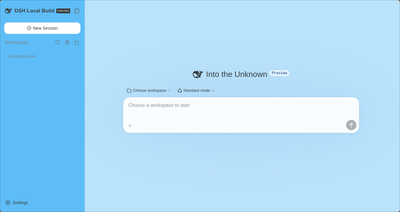<br>Oceans | 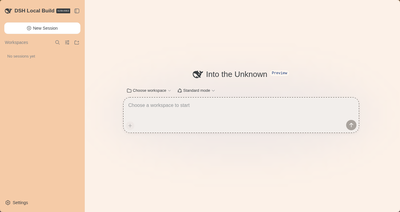<br>Orange Juice |
| 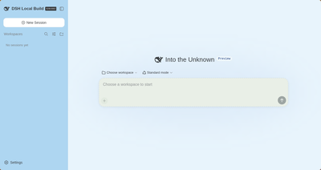<br>Snow Water | 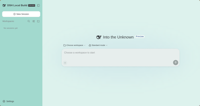<br>Turquoise |
| 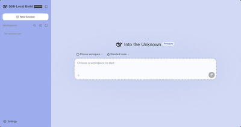<br>Ultramarine | 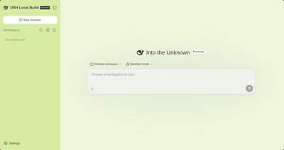<br>Yuzu |

## 许可

MIT —— 详见 [LICENSE](LICENSE)。
